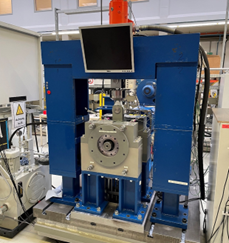
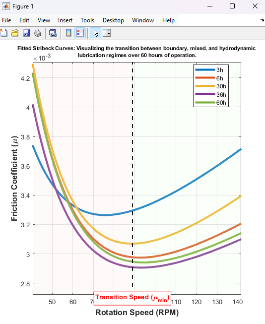
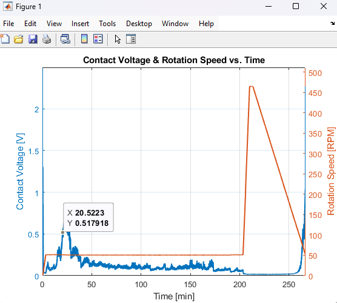

# Journal-Bearing Friction & Wear Analysis 
### 🎓 Master's Research Project | Tribology & Data Science

This repository contains the MATLAB implementation for analyzing lubrication regime transitions in journal bearings under high-load conditions (20 MPa).

## 📊 Experimental Results

### Test Bench Setup
Detailed view of the DC-motor driven test rig used for high-load (20 MPa) bearing analysis.

### Stribeck Curve Transition
Identification of friction regimes (Boundary, Mixed, Hydrodynamic) using exponential curve fitting.

### High-Resolution Signal Analysis
Synchronization of 1024 Hz contact voltage signals to detect metallic contact.

## 👥 The Team
* **Maliha Rajwana Haque**
* **Jayin Kaliappan Prakash**
* **Pandeeswaramoorthy Marichelvam**
* **Arun Kumar Senthil Vinayagam**
